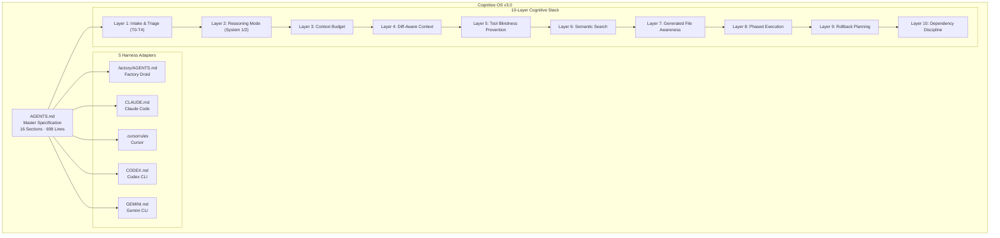

# Cognitive OS — AI Agent Operating System & Multi-Harness Specification

[](https://github.com/aegntic/cognitive-os/actions/workflows/ci.yml)
[](https://github.com/aegntic/cognitive-os/actions/workflows/codeql.yml)
[](LICENSE)
[](https://github.com/aegntic/cognitive-os/actions/workflows/ci.yml)

> **The future is not predicted. It is compiled.**

**Cognitive OS** is a universal cognitive operating system specification for AI coding agents. It defines a production-grade, 16-section cognitive architecture that governs how LLM-powered agents think, plan, verify, and execute across real-world systems. Unlike single-harness prompt files, Cognitive OS auto-adapts to **Claude Code**, **Cursor**, **Codex CLI**, **Gemini CLI**, and **Factory Droid** through a single master specification.

---

## Table of Contents

1. [Why Cognitive OS?](#why-cognitive-os)
2. [Key Features](#key-features)
3. [What Problem Does This Solve?](#what-problem-does-this-solve)
4. [Harness Adapters](#harness-adapters)
5. [Quick Start](#quick-start)
6. [Architecture Overview](#architecture-overview)
7. [Build & Test Commands](#build--test-commands)
8. [Comparison: Cognitive OS vs Other Approaches](#comparison-cognitive-os-vs-other-approaches)
9. [FAQ](#faq)
10. [File Structure](#file-structure)
11. [Contributing](#contributing)
12. [Changelog](#changelog)
13. [Security](#security)
14. [License](#license)

---

## Why Cognitive OS?

AI coding agents (Claude Code, Cursor, Codex, Gemini, Factory Droid) share the same fundamental problems: context window exhaustion, unverified outputs, prompt injection vulnerabilities, inconsistent reasoning quality, and untracked token costs. Existing solutions are fragmented, harness-specific, and lack formal verification protocols.

**Cognitive OS solves this** with a single, universal specification that any AI agent can load. It provides:

- **Structured reasoning** through a 10-layer cognitive stack (from intake triage to dependency discipline)
- **Autonomous verification** through a mandatory 7-step verification chain (type check, lint, unit tests, integration tests, build, security scan, impact analysis)
- **Multi-agent coordination** through swarm protocols with worktree isolation and DAG execution
- **Cost-aware execution** with per-task budget enforcement and ROI-aware routing
- **Self-improvement** through a continuous learning loop that encodes patterns into reusable skills

## Key Features

| Feature                   | Description                                                                                                                                                                                                                         | Sections |
| ------------------------- | ----------------------------------------------------------------------------------------------------------------------------------------------------------------------------------------------------------------------------------- | -------- |
| 10-Layer Cognitive Stack  | Intake triage (T0-T4), reasoning modes (System-1/System-2), context budgeting, diff-aware editing, tool blindness prevention, semantic search, generated file awareness, phased execution, rollback planning, dependency discipline | 1        |
| Multi-Model Orchestration | Task complexity routing matrix, ensemble verification across model families, cost-aware execution with per-complexity budgets, model fallback chains                                                                                | 2        |
| 4-Layer Memory Stack      | Working memory (session), episodic memory (cross-session), semantic memory (permanent knowledge), procedural memory (skills and automations)                                                                                        | 3        |
| Autonomous Verification   | Mandatory verification chain, self-healing pipeline (max 3 attempts), property-based testing, adversarial self-red-teaming                                                                                                          | 4        |
| Swarm Coordination        | Sub-agent swarming by semantic boundary, git worktree isolation, DAG execution patterns, structured agent communication                                                                                                             | 5        |
| Adversarial Security      | Pre-commit security checklist, prompt injection defense, circuit breakers (cost/failure/file limits), DeFi/trading-specific constraints                                                                                             | 6        |
| Economic Intelligence     | Token cost tracking per operation, ROI-aware task routing, context window as scarce resource with pruning strategy                                                                                                                  | 7        |
| Self-Improvement          | Continuous learning loop, instinct evolution lifecycle, failure-as-signal analysis, monthly meta-learning review                                                                                                                    | 8        |
| Real-World Actuation      | Browser automation protocol, deployment safety gates, trading system constraints, system operations guardrails                                                                                                                      | 9        |
| Observability & Tracing   | Session telemetry, quality gates (pre-implementation, pre-commit, pre-deploy), eval-driven development                                                                                                                              | 10       |
| Code Quality Standards    | Universal rules plus language-specific standards for TypeScript/React, Python, Rust, and Solidity/DeFi                                                                                                                              | 11       |
| SPARC Methodology         | Specification, Pseudocode, Architecture, Refinement, Completion workflow integration                                                                                                                                                | 12       |

## What Problem Does This Solve?

**Problem**: AI coding agents lack a standardized cognitive framework. Each agent harness (Claude Code, Cursor, Codex, Gemini) reinvents reasoning, verification, and safety independently, leading to inconsistent quality, untracked costs, and security blind spots.

**Solution**: Cognitive OS provides a single master specification (`AGENTS.md`, 699 lines, 16 sections) that every harness loads via a thin adapter. The spec enforces:

1. **Complexity-aware routing**: Tasks are classified T0 (trivial) through T4 (existential) before any work begins, ensuring the right model and ceremony level
2. **Mandatory verification**: No task is reported complete until the full verification chain passes (type check, lint, tests, build, security scan)
3. **Context safety**: Automatic context budget management with danger-zone detection and compaction recommendations
4. **Security by default**: Prompt injection defense, circuit breakers, secret scanning, and adversarial self-red-teaming for T3+ tasks
5. **Cost transparency**: Every operation has a tracked token cost, with budget enforcement per task complexity level

## Harness Adapters

Cognitive OS auto-detects the active AI agent harness and loads the appropriate adapter. Each adapter is a thin shim that references the master `AGENTS.md` specification:

| Harness           | Config File          | Optimized For                                                                                                              |
| ----------------- | -------------------- | -------------------------------------------------------------------------------------------------------------------------- |
| **Factory Droid** | `.factory/AGENTS.md` | Droid-specific shims, MCP servers (Vercel, Firebase, Playwright, Context7, Shadcn), sub-agent strategy, custom droids      |
| **Claude Code**   | `CLAUDE.md`          | ECC agent registry (63 agents, 249 skills), gstack integration, GLM-5.2/Gemini 3.1 Pro model routing, gbrain PGLite memory |
| **Cursor**        | `.cursorrules`       | Compact subset optimized for code completion, inline edits, and chat interactions                                          |
| **Codex CLI**     | `CODEX.md`           | OpenAI-optimized directives with Codex-specific syntax conventions                                                         |
| **Gemini CLI**    | `GEMINI.md`          | Google-optimized with Gemini extensions and Google Cloud integration patterns                                              |

### Adding a New Harness Adapter

1. Create the adapter file (e.g., `NEWHARNESS.md`)
2. Reference the master spec: `> Full spec: AGENTS.md`
3. Include harness-specific overrides for model routing, tooling, and MCP servers
4. Add to the harness table in README.md and CODEOWNERS
5. Add to CI `docs-validation` job

## Quick Start

```bash
# Clone the repository
git clone https://github.com/aegntic/cognitive-os.git
cd cognitive-os

# Install tooling (markdown linter, formatter, pre-commit hooks)
npm install

# Validate all markdown files and run 106 tests
npm test

# Run full validation suite (lint + format check + test)
npm run validate

# Start editing AGENTS.md (master spec) or any harness adapter
```

### Using Cognitive OS in Your Project

Copy `AGENTS.md` and the adapter for your harness into your project root:

```bash
# For Claude Code
cp AGENTS.md CLAUDE.md /your/project/

# For Cursor
cp AGENTS.md .cursorrules /your/project/

# For Factory Droid
cp -r AGENTS.md .factory/ /your/project/
```

The agent will auto-detect and load the specification at session start.

## Architecture Overview



See [docs/architecture.md](docs/architecture.md) for full system diagrams including task complexity routing, verification chain flow, and file dependency graphs.

## Build & Test Commands

| Command                | Description                                                            |
| ---------------------- | ---------------------------------------------------------------------- |
| `npm install`          | Install dependencies and set up pre-commit hooks (husky + lint-staged) |
| `npm test`             | Run 106 vitest tests across 5 test suites                              |
| `npm run lint`         | Lint all markdown files with markdownlint-cli2                         |
| `npm run lint:fix`     | Auto-fix markdown linting issues                                       |
| `npm run format`       | Format all files with Prettier                                         |
| `npm run format:check` | Check formatting without modifying files                               |
| `npm run validate`     | Run full validation suite (lint + format check + test)                 |
| `npm run dev`          | Alias for `npm run validate`                                           |

## Comparison: Cognitive OS vs Other Approaches

| Approach                 | Multi-Harness                                      | Verification Chain     | Memory Stack                                      | Cost Tracking                     | Security Framework                | Self-Improvement                   |
| ------------------------ | -------------------------------------------------- | ---------------------- | ------------------------------------------------- | --------------------------------- | --------------------------------- | ---------------------------------- |
| **Cognitive OS**         | 5 harnesses (Claude, Cursor, Codex, Gemini, Droid) | 7-step mandatory chain | 4-layer (working, episodic, semantic, procedural) | Per-task budgets with ROI routing | Adversarial with circuit breakers | Learning loop + instinct evolution |
| Single `.cursorrules`    | Cursor only                                        | None                   | None                                              | None                              | None                              | None                               |
| Single `CLAUDE.md`       | Claude Code only                                   | Manual                 | None                                              | None                              | Basic                             | None                               |
| Generic prompt templates | None                                               | None                   | None                                              | None                              | None                              | None                               |
| Custom per-project rules | Per-project                                        | Ad hoc                 | None                                              | Rarely                            | Ad hoc                            | None                               |

## FAQ

### What is Cognitive OS?

Cognitive OS is a universal cognitive operating system specification for AI coding agents. It defines a 16-section cognitive architecture (699 lines) that governs how LLM-powered agents reason, verify, coordinate, and improve. It is not a library or application but a **living specification** loaded by AI agents at session start.

### How does Cognitive OS work with different AI agents?

Cognitive OS uses a master specification (`AGENTS.md`) paired with thin harness adapters. When an AI agent session starts, it detects which harness is active (Claude Code, Cursor, Codex, Gemini, or Factory Droid) and loads the corresponding adapter file, which references the master spec for full directives.

### Is Cognitive OS open source?

Cognitive OS is proprietary. The specification is publicly viewable for reference and evaluation. See [LICENSE](LICENSE) for details.

### What programming languages and frameworks does Cognitive OS support?

Cognitive OS provides code quality standards for TypeScript/React, Python, Rust, and Solidity/DeFi. The cognitive architecture itself is language-agnostic and works with any AI coding agent that supports markdown configuration files.

### How many tests does Cognitive OS have?

The repository includes 106 automated tests across 5 test suites, covering master specification validation, harness adapter cross-references, repository structure, documentation freshness, and governance file integrity. All tests run in under 120ms.

### Does Cognitive OS support multi-agent coordination?

Yes. Cognitive OS defines a full swarm coordination protocol including sub-agent swarming by semantic boundary, git worktree isolation for parallel work, DAG execution patterns for dependency-ordered task completion, and structured inter-agent communication via report format.

### What is the SPARC methodology in Cognitive OS?

SPARC (Specification, Pseudocode, Architecture, Refinement, Completion) is the development workflow methodology integrated into Cognitive OS section 12. It guides agents through structured phases from requirements definition to final verification.

### How does Cognitive OS handle security?

Cognitive OS includes a 6-part adversarial security framework: mandatory pre-commit security checklist, prompt injection defense, circuit breakers (cost/failure/file thresholds), DeFi-specific constraints, deployment safety gates, and system operations guardrails. See [.github/SECURITY.md](.github/SECURITY.md) for vulnerability reporting.

## File Structure

```
.
├── AGENTS.md              # Master specification (699 lines, 16 sections)
├── CLAUDE.md              # Claude Code adapter (ECC, gstack, model routing)
├── CODEX.md               # Codex CLI adapter (OpenAI-optimized)
├── GEMINI.md              # Gemini CLI adapter (Google-optimized)
├── .cursorrules           # Cursor adapter (compact subset)
├── .factory/
│   ├── AGENTS.md          # Factory Droid adapter (MCP, sub-agents)
│   └── skills/            # Agent skills directory
├── .github/
│   ├── workflows/         # CI, CodeQL, stale bot, release automation
│   ├── SECURITY.md        # Security policy and vulnerability reporting
│   ├── CODEOWNERS         # Ownership rules for code review
│   ├── pull_request_template.md
│   └── ISSUE_TEMPLATE/    # Bug report and feature request templates
├── .devcontainer/         # VS Code devcontainer configuration
├── docs/
│   ├── architecture.md    # System diagrams (Mermaid)
│   └── runbooks.md        # Operational procedures
├── tests/                 # 106 vitest tests across 5 suites
├── vitest.config.ts       # Test configuration (retry, coverage thresholds)
├── package.json           # Project tooling and scripts
├── CHANGELOG.md           # Version history (Keep a Changelog format)
├── CONTRIBUTING.md        # Contribution guidelines
├── LICENSE                # Proprietary license
└── README.md              # This file
```

## Contributing

See [CONTRIBUTING.md](CONTRIBUTING.md) for naming conventions, testing guidelines, commit message format, and development workflow.

## Changelog

See [CHANGELOG.md](CHANGELOG.md) for version history and notable changes.

## Security

See [.github/SECURITY.md](.github/SECURITY.md) for vulnerability reporting instructions and security measures.

## License

Proprietary. All rights reserved. See [LICENSE](LICENSE) for details.

---

**Keywords**: AI agent specification, cognitive operating system, LLM coding agent, multi-harness AI, Claude Code instructions, Cursor rules, Codex CLI directives, Gemini CLI configuration, Factory Droid AGENTS.md, prompt engineering framework, AI agent cognitive architecture, autonomous agent verification, multi-agent coordination, swarm protocol, adversarial AI security, token economics, SPARC methodology, AI agent memory stack, prompt injection defense, AI coding assistant specification
