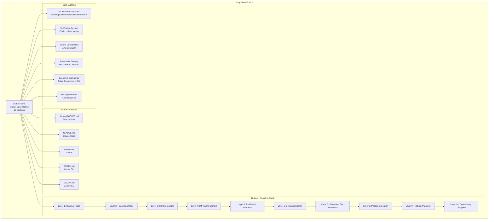
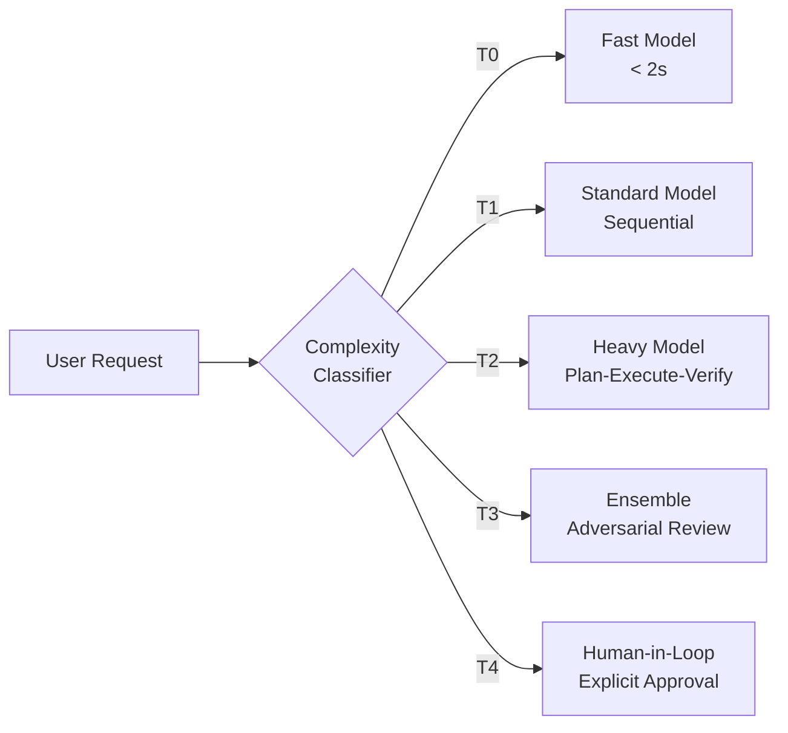
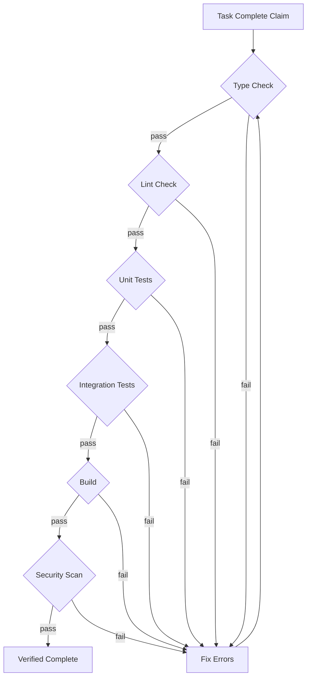

# Cognitive OS Architecture

## System Overview

## Task Complexity Routing

## Verification Chain

## File Dependencies

| File                 | Depends On  | Used By       |
| -------------------- | ----------- | ------------- |
| `AGENTS.md`          | (root spec) | All adapters  |
| `.factory/AGENTS.md` | `AGENTS.md` | Factory Droid |
| `CLAUDE.md`          | `AGENTS.md` | Claude Code   |
| `.cursorrules`       | `AGENTS.md` | Cursor        |
| `CODEX.md`           | `AGENTS.md` | Codex CLI     |
| `GEMINI.md`          | `AGENTS.md` | Gemini CLI    |
